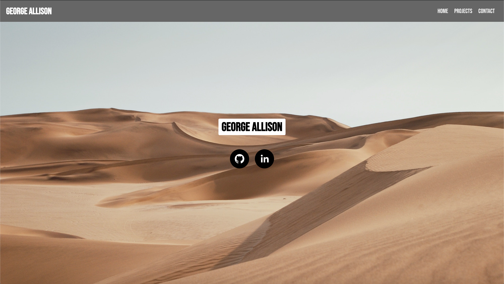

My Portfolio Page
===================
---
This is a web page created in React to act as a centralized hub for previous and current projects. The main purpose is to link to my GitHub and LinkedIn for now. Soon I will link to websites I have built and possibly include a short bio.

A link to the website: georgeallisontech.com
---

Here is a snapshot of the current website.
---
## To-Do
- [ ] Add click-scroll from Nav bar.
- [ ] Add links to major projects.